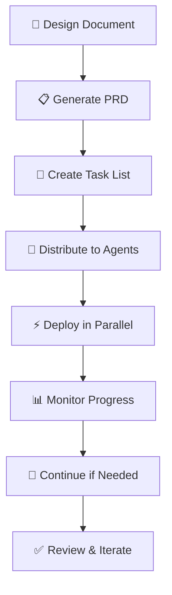

# 🚀 Multi-Agent Development Guide

> Transform your development workflow with AI agents working in parallel

## 🤔 What is Multi-Agent Development?

Multi-agent development is a **powerful approach** that allows you to deploy multiple AI agents (3-5 Claude instances) to work simultaneously on different parts of your project. Instead of having one agent work through tasks sequentially, you can dramatically speed up development by having specialized agents focus on different areas.

### 🎯 Focus Areas
- 🔧 **Backend APIs** 
- 🎨 **Frontend components**
- 🗄️ **Database design**
- 🧪 **Testing & QA**
- 🚢 **DevOps & deployment**

---

## 🌟 Why Use Multi-Agent Development?

### ⚡ Speed Benefits
- **3-5x faster development** → Multiple agents working in parallel
- **Reduced waiting time** → No need to wait for one task to finish before starting another
- **Concurrent execution** → Backend and frontend can be developed simultaneously

### 🎯 Quality Benefits
- **Specialized expertise** → Each agent focuses on their area of expertise
- **Conflict prevention** → Built-in coordination prevents agents from interfering
- **Code consistency** → Agents follow shared guidelines and patterns
- **Automatic progress tracking** → Real-time monitoring of all agents

### 🛠️ Practical Benefits
- **Easy to manage** → Simple commands handle complex coordination
- **Resume capability** → If an agent hits context limits, easily continue where you left off
- **Automatic commits** → Each completed subtask is automatically committed to git
- **Dependency management** → Agents know when to wait for prerequisites

---

## 🔄 How It Works

### 📋 The Big Picture



1. **📄 Start with a design document** describing what you want to build
2. **📋 Generate a Product Requirements Document (PRD)** that details the technical requirements
3. **📝 Create a comprehensive task list** breaking down all the work needed
4. **🤖 Automatically distribute tasks** across 3-5 specialized agents
5. **⚡ Deploy all agents in parallel** to work simultaneously
6. **📊 Monitor progress** through a central coordination file
7. **🔄 Continue interrupted work** if any agent hits limits
8. **✅ Review and iterate** when complete

### 🎛️ Behind the Scenes

The system creates several important files:

| File | Purpose |
|------|---------|
| 📝 `tasks/agent-1-tasks.md` | Each agent gets their own focused task list |
| 📝 `tasks/agent-2-tasks.md` | Agent-specific work assignments |
| 📊 `tasks/multi-agent-coordination.md` | Central hub tracking all agent progress |
| 💬 Agent prompts | Clear instructions about roles and responsibilities |

### 🧠 Smart Coordination

The system automatically handles:

| Feature | Description |
|---------|-------------|
| 🔗 **Task dependencies** | Agent 2 waits for Agent 1 to finish database models before starting API endpoints |
| 🚫 **Conflict prevention** | Agents won't work on the same files simultaneously |
| 📈 **Progress tracking** | Real-time updates on completion percentages and context usage |
| 🤝 **Handoffs** | When one agent completes work that another needs, they coordinate the handoff |

---

## 📱 Real-World Example

Let's say you're building a **climbing partner app**. Here's how the agents might be organized:

### 🤖 Agent 1: Backend Core & Database
- 🗄️ Design database schema for users, climbing profiles, locations
- 🏗️ Create Django models with proper relationships  
- 🔐 Set up authentication and user management
- 🔌 Build core API endpoints for user operations

### 🤖 Agent 2: Search & Matching Features  
- 🗺️ Implement geospatial search using PostGIS
- 🎯 Create compatibility scoring algorithms
- 💡 Build partner suggestion system
- 🔍 Add search filters and pagination

### 🤖 Agent 3: AI & Intelligence
- 🧠 Integrate OpenAI API for natural language search
- 🤝 Develop machine learning for partner matching
- 📊 Create feedback systems to improve suggestions
- ⚡ Implement async processing with Celery

### 🤖 Agent 4: Frontend & Messaging
- ⚛️ Build React frontend with TypeScript
- 💬 Create real-time messaging with WebSockets
- 📱 Design responsive UI components
- 🔔 Implement notifications and user interactions

> Each agent works independently in their area while the coordination system ensures they don't conflict and that dependencies are handled properly.

---

## 🚀 Getting Started

### ✅ Prerequisites
- 📄 Have a design document describing your project
- 🔧 Access to Claude Code
- 🗂️ Git repository for your project

### ⚡ Quick Start (5 minutes)

#### 1️⃣ **Generate your PRD**:
```bash
/user:prd:generate my-design-doc.md
```

#### 2️⃣ **Create comprehensive task list**:
```bash
/user:tasks:generate
```

#### 3️⃣ **Distribute to 4 agents**:
```bash
/user:tasks:generate-multi-agent tasks/tasks-list.md --agents 4
```

#### 4️⃣ **Deploy all agents**:
```bash
/user:tasks:execute-multi-agent
```

🎉 **That's it!** The agents are now working in parallel on your project.

### 📊 Monitoring Progress

Check the coordination file to see real-time progress:
```bash
cat tasks/multi-agent-coordination.md
```

You'll see something like:
```
## 🤖 Agent Status
- Agent 1: ✅ Active (65% complete, 45% context used)
- Agent 2: ⏸️ Waiting (80% complete, 78% context used)  
- Agent 3: ✅ Active (50% complete, 30% context used)
- Agent 4: ✅ Active (25% complete, 20% context used)

## 📊 Progress Summary
Total Tasks: 45
Completed: 28 (62%)
In Progress: 7
Remaining: 10
```

---

## 🔧 Common Scenarios

### 🚨 What if an agent gets stuck?

If an agent hits their context limit or encounters an issue:

```bash
# Continue a specific agent
/user:tasks:continue 2

# Continue all agents that stopped
/user:tasks:continue-parallel
```

### ⚖️ What if tasks need rebalancing?

If one agent finishes early and another is overloaded:

```bash
/user:tasks:reorganize tasks/agent-1-tasks.md tasks/agent-3-tasks.md
```

### 🎯 What if you want to focus on specific areas?

Deploy only certain agents:
```bash
/user:tasks:execute-multi-agent --agents 1,3 --mode parallel
```

### 🛠️ What if you need custom agent specialization?

For unique scenarios:
```bash
/user:deploy:multiple-agents "Create 3 agents to optimize each microservice" --from-file architecture.md
```

---

## 🔬 Advanced Features

### 🔍 Project Review and DevOps

Deploy specialized agents to review your entire project:
```bash
/user:project-devops
```

This creates agents to:
- 📖 Review and improve your README
- 🏗️ Analyze codebase architecture
- 🧪 Review and enhance tests
- 🛠️ Generate development environment setup instructions

### 🔄 Iterative Development

After completing a phase, generate the next iteration:
```bash
/user:prd:iterate-project --mode next-phase
```

### 🎛️ Custom Workflows

For specialized workflows, you can chain commands:
```bash
# Complete workflow for a new feature
/user:prd:generate feature-design.md
/user:tasks:generate
/user:tasks:generate-multi-agent tasks/tasks-list.md --agents 3
/user:tasks:execute-multi-agent
/user:tasks-mark-complete
/user:tasks-commit
```

---

## 📚 Best Practices

### 👥 Agent Count
| Project Size | Recommended Agents | Use Case |
|--------------|-------------------|----------|
| **3 agents** | Small projects | Focused features or prototypes |
| **4 agents** | Medium projects | Most full-stack applications |
| **5 agents** | Large projects | Complex systems with many moving parts |

### 📋 Task Organization
- ✅ Let the system automatically distribute tasks - it's smarter than manual distribution
- 🧠 The system analyzes dependencies and assigns tasks to prevent conflicts
- 🎯 Each agent gets tasks that naturally fit together

### 📊 Monitoring and Management
- 👀 Check the coordination file regularly to monitor progress
- 🚫 Don't interrupt agents unless they've stopped due to context limits
- 🔄 Use the continue commands when agents pause, rather than restarting from scratch

### 💎 Code Quality
- 📏 Each agent follows the same coding standards and patterns
- 💾 Automatic git commits ensure no work is lost
- 🚫 The coordination system prevents merge conflicts

---

## 🛠️ Troubleshooting

### ❓ "Only one agent was running"
```bash
/user:parallel-persist
```

### ❓ "Tasks are unbalanced between agents"
```bash
/user:tasks:reorganize tasks/agent-1-tasks.md tasks/agent-2-tasks.md
```

### ❓ "I want to see what each agent is working on"
```bash
# List all agent task files
ls tasks/agent-*-tasks.md

# Check specific agent progress
cat tasks/agent-1-tasks.md
```

### ❓ "An agent seems stuck or not responding"
```bash
# Continue the specific agent
/user:tasks:continue 2

# Or continue all stopped agents
/user:tasks:continue-parallel
```

---

## 🏆 Real Benefits You'll See

### ⚡ Development Speed
- 📅 Projects that normally take **weeks** can be completed in **days**
- 🔄 Multiple complex features developed simultaneously
- 🎯 Reduced context switching between different types of work

### 💎 Code Quality
- 🎨 Consistent patterns across the entire codebase
- 🏗️ Proper separation of concerns enforced by agent specialization
- 🧪 Comprehensive test coverage when testing agents are included

### 📊 Project Management
- 👁️ Clear visibility into progress across all work streams
- 🤖 Automatic dependency management
- 🚫 Built-in coordination prevents conflicts and rework

### 📖 Learning and Knowledge Transfer
- 📝 Each agent documents their work and decision-making
- 🎯 Clear separation makes the codebase easier to understand
- 📋 Coordination files serve as project documentation

---

## 🎯 Conclusion

Multi-agent development **transforms** how you build software. Instead of working through tasks one by one, you orchestrate a team of specialized AI agents that collaborate intelligently to build your project **faster** and with **higher quality**.

> The system handles all the complex coordination, dependency management, and conflict prevention automatically. You simply define what you want to build, and the agents figure out how to work together to make it happen.

🚀 **Try it on your next project** - you'll be amazed at how much faster and smoother development becomes when you have a coordinated team of AI agents working for you!