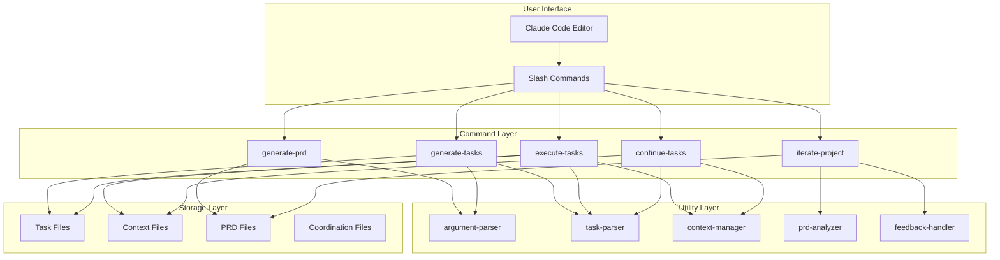
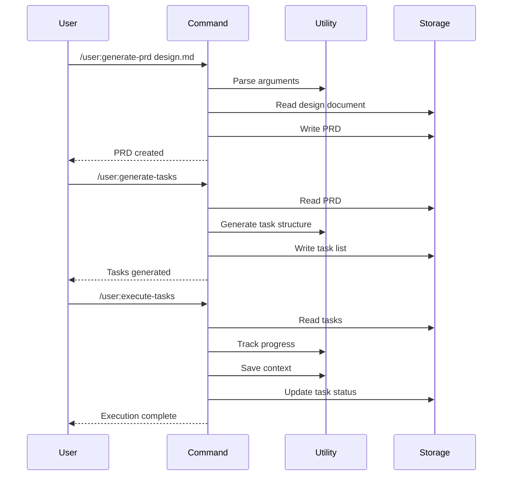

# Documentation Updater Utilities

Utilities for automatically updating project documentation based on implementation changes and iterations.

## Purpose

Provides automated documentation maintenance to ensure docs stay synchronized with the actual implementation throughout the development lifecycle.

## Core Functions

### update_readme()

Updates the main README.md with current project status.

```bash
update_readme() {
    local readme_file="${1:-README.md}"
    local backup_file="${readme_file}.backup"
    
    # Create backup
    cp "$readme_file" "$backup_file" 2>/dev/null || true
    
    # Gather project statistics
    local total_commands=$(ls ~/.claude/commands/*.md 2>/dev/null | wc -l)
    local total_utils=$(ls utils/*.md 2>/dev/null | wc -l)
    local total_tests=$(find tests -name "*.test.md" 2>/dev/null | wc -l)
    
    # Calculate overall completion
    local total_tasks=0
    local completed_tasks=0
    for task_file in tasks/agent-*-tasks.md; do
        if [[ -f "$task_file" ]]; then
            local file_total=$(grep -c "^[[:space:]]*-[[:space:]]\[.\]" "$task_file" 2>/dev/null || echo 0)
            local file_completed=$(grep -c "^[[:space:]]*-[[:space:]]\[x\]" "$task_file" 2>/dev/null || echo 0)
            total_tasks=$((total_tasks + file_total))
            completed_tasks=$((completed_tasks + file_completed))
        fi
    done
    local completion_percent=$((completed_tasks * 100 / (total_tasks + 1)))
    
    # Update or create README
    cat > "$readme_file" << EOF
# Claude Code Workflow Automation System

A powerful automation system for Claude Code that eliminates manual copy-paste operations and enables efficient multi-agent task execution through custom slash commands.

## 🚀 Project Status

- **Overall Completion:** ${completion_percent}% (${completed_tasks}/${total_tasks} tasks)
- **Commands Implemented:** ${total_commands}
- **Utilities Created:** ${total_utils}
- **Tests Written:** ${total_tests}
- **Last Updated:** $(date)

## 📋 Overview

This system automates common development workflows in Claude Code through:

- **PRD Generation** - Transform design documents into structured PRDs
- **Task Management** - Automatically generate and distribute tasks
- **Multi-Agent Execution** - Run parallel agents for faster development
- **Workflow Continuation** - Resume interrupted work seamlessly
- **Iterative Development** - Analyze and improve through cycles

## 🛠️ Installation

1. Clone this repository:
   \`\`\`bash
   git clone <repository-url>
   cd claude-agentic-loop
   \`\`\`

2. Install the commands:
   \`\`\`bash
   ./install.sh
   \`\`\`

3. Verify installation:
   \`\`\`bash
   ls ~/.claude/commands/
   \`\`\`

## 📚 Available Commands

| Command | Description | Status |
|---------|-------------|--------|
EOF
    
    # List all commands with status
    for cmd_file in ~/.claude/commands/*.md; do
        if [[ -f "$cmd_file" ]]; then
            local cmd_name=$(basename "$cmd_file" .md)
            local cmd_desc=$(grep -m1 "^#" "$cmd_file" | sed 's/^# *//' || echo "No description")
            echo "| \`/user:$cmd_name\` | $cmd_desc | ✅ Implemented |" >> "$readme_file"
        fi
    done
    
    # Add remaining sections
    cat >> "$readme_file" << 'EOF'

## 🚦 Quick Start

### 1. Generate a PRD from Design Document

```bash
/user:generate-prd design-doc.md
```

### 2. Create Task List

```bash
/user:generate-tasks
```

### 3. Distribute Tasks to Agents

```bash
/user:generate-multi-agent-tasks
```

### 4. Execute Tasks

```bash
/user:execute-multi-agent-tasks
```

### 5. Continue Interrupted Work

```bash
/user:continue-tasks 2
```

### 6. Iterate and Improve

```bash
/user:iterate-project
```

## 📖 Documentation

- [Installation Guide](docs/installation-guide.md)
- [Command Reference](docs/command-reference.md)
- [Best Practices](docs/best-practices.md)
- [Troubleshooting](docs/troubleshooting.md)
- [Examples](examples/)

## 🤝 Contributing

See [CONTRIBUTING.md](CONTRIBUTING.md) for guidelines.

## 📝 License

This project is licensed under the MIT License - see [LICENSE](LICENSE) for details.
EOF
    
    echo "README.md updated successfully"
}
```

### update_command_reference()

Updates the command reference documentation.

```bash
update_command_reference() {
    local ref_file="${1:-docs/command-reference.md}"
    
    mkdir -p "$(dirname "$ref_file")"
    
    cat > "$ref_file" << 'EOF'
# Command Reference

Complete reference for all Claude Code Workflow Automation commands.

## Table of Contents

EOF
    
    # Generate TOC
    for cmd_file in ~/.claude/commands/*.md; do
        if [[ -f "$cmd_file" ]]; then
            local cmd_name=$(basename "$cmd_file" .md)
            echo "- [\`/user:$cmd_name\`](#user$cmd_name)" >> "$ref_file"
        fi
    done
    
    echo "" >> "$ref_file"
    echo "---" >> "$ref_file"
    echo "" >> "$ref_file"
    
    # Add detailed command documentation
    for cmd_file in ~/.claude/commands/*.md; do
        if [[ -f "$cmd_file" ]]; then
            local cmd_name=$(basename "$cmd_file" .md)
            echo "## /user:$cmd_name" >> "$ref_file"
            echo "" >> "$ref_file"
            
            # Extract sections from command file
            local in_section=""
            while IFS= read -r line; do
                if [[ "$line" =~ ^##[[:space:]](.+) ]]; then
                    in_section="${BASH_REMATCH[1]}"
                    if [[ "$in_section" == "Arguments" ]] || \
                       [[ "$in_section" == "Usage" ]] || \
                       [[ "$in_section" == "Workflow" ]]; then
                        echo "### $in_section" >> "$ref_file"
                        echo "" >> "$ref_file"
                    fi
                elif [[ -n "$in_section" ]] && \
                     ([[ "$in_section" == "Arguments" ]] || \
                      [[ "$in_section" == "Usage" ]] || \
                      [[ "$in_section" == "Workflow" ]]); then
                    echo "$line" >> "$ref_file"
                fi
            done < "$cmd_file"
            
            echo "" >> "$ref_file"
            echo "---" >> "$ref_file"
            echo "" >> "$ref_file"
        fi
    done
    
    echo "Command reference updated: $ref_file"
}
```

### update_changelog()

Maintains a changelog based on git commits.

```bash
update_changelog() {
    local changelog_file="${1:-CHANGELOG.md}"
    local since_tag="${2:-}"
    
    # Get version from PRD files
    local version="1.0.0"
    if [[ -f "tasks/project-prd-v2.md" ]]; then
        version="2.0.0"
    elif [[ -f "tasks/project-prd-v3.md" ]]; then
        version="3.0.0"
    fi
    
    # Create or update changelog
    if [[ ! -f "$changelog_file" ]]; then
        cat > "$changelog_file" << 'EOF'
# Changelog

All notable changes to the Claude Code Workflow Automation System.

The format is based on [Keep a Changelog](https://keepachangelog.com/en/1.0.0/).

EOF
    fi
    
    # Create temporary file for new entry
    local temp_file="${changelog_file}.tmp"
    
    # Add new version section
    cat > "$temp_file" << EOF
## [$version] - $(date +%Y-%m-%d)

### Added
EOF
    
    # Extract added features from recent commits
    git log --oneline --grep="Implement\|Create\|Add" ${since_tag:+$since_tag..HEAD} | \
        sed 's/^[^ ]* /- /' | head -10 >> "$temp_file"
    
    echo "" >> "$temp_file"
    echo "### Changed" >> "$temp_file"
    git log --oneline --grep="Update\|Improve\|Enhance" ${since_tag:+$since_tag..HEAD} | \
        sed 's/^[^ ]* /- /' | head -5 >> "$temp_file"
    
    echo "" >> "$temp_file"
    echo "### Fixed" >> "$temp_file"
    git log --oneline --grep="Fix\|Resolve\|Correct" ${since_tag:+$since_tag..HEAD} | \
        sed 's/^[^ ]* /- /' | head -5 >> "$temp_file"
    
    echo "" >> "$temp_file"
    echo "---" >> "$temp_file"
    echo "" >> "$temp_file"
    
    # Append existing changelog
    if [[ -f "$changelog_file" ]]; then
        # Skip the header
        tail -n +5 "$changelog_file" >> "$temp_file"
    fi
    
    # Replace original
    mv "$temp_file" "$changelog_file"
    
    echo "Changelog updated: $changelog_file"
}
```

### generate_architecture_diagram()

Creates an architecture diagram in Mermaid format.

```bash
generate_architecture_diagram() {
    local output_file="${1:-docs/architecture.md}"
    
    mkdir -p "$(dirname "$output_file")"
    
    cat > "$output_file" << 'EOF'
# System Architecture

## Overview

The Claude Code Workflow Automation System follows a modular architecture with clear separation of concerns.

## Component Diagram



## Data Flow



## File Structure

```
project-root/
├── .claude/
│   └── commands/          # User-installed commands
├── tasks/
│   ├── project-prd.md     # Current PRD
│   ├── tasks-list.md      # Master task list
│   ├── agent-*-tasks.md   # Agent-specific tasks
│   └── agent-contexts/    # Saved agent states
├── utils/                 # Shared utilities
├── tests/                 # Test suites
├── docs/                  # Documentation
└── examples/              # Usage examples
```

## Key Design Principles

1. **Modularity** - Each component has a single responsibility
2. **Reusability** - Utilities are shared across commands
3. **Persistence** - State is saved for continuity
4. **Scalability** - Supports multiple parallel agents
5. **Extensibility** - Easy to add new commands and features
EOF
    
    echo "Architecture documentation created: $output_file"
}
```

### sync_task_status()

Synchronizes task status across documentation.

```bash
sync_task_status() {
    local status_file="${1:-docs/task-status.md}"
    
    mkdir -p "$(dirname "$status_file")"
    
    cat > "$status_file" << 'EOF'
# Task Status Report

**Generated:** $(date)

## Overall Progress

EOF
    
    # Calculate totals
    local total_all=0
    local completed_all=0
    
    for task_file in tasks/agent-*-tasks.md; do
        if [[ -f "$task_file" ]]; then
            local total=$(grep -c "^[[:space:]]*-[[:space:]]\[.\]" "$task_file" 2>/dev/null || echo 0)
            local completed=$(grep -c "^[[:space:]]*-[[:space:]]\[x\]" "$task_file" 2>/dev/null || echo 0)
            total_all=$((total_all + total))
            completed_all=$((completed_all + completed))
        fi
    done
    
    local percent=$((completed_all * 100 / (total_all + 1)))
    
    echo "**Total Progress:** $completed_all / $total_all tasks ($percent%)" >> "$status_file"
    echo "" >> "$status_file"
    
    # Progress bar
    echo "Progress Bar:" >> "$status_file"
    echo -n "[" >> "$status_file"
    local filled=$((percent / 5))
    for ((i=0; i<20; i++)); do
        if [[ $i -lt $filled ]]; then
            echo -n "█" >> "$status_file"
        else
            echo -n "░" >> "$status_file"
        fi
    done
    echo "] $percent%" >> "$status_file"
    echo "" >> "$status_file"
    
    # Per-agent breakdown
    echo "## Agent Status" >> "$status_file"
    echo "" >> "$status_file"
    
    for task_file in tasks/agent-*-tasks.md; do
        if [[ -f "$task_file" ]]; then
            local agent_name=$(basename "$task_file" .md)
            local total=$(grep -c "^[[:space:]]*-[[:space:]]\[.\]" "$task_file" 2>/dev/null || echo 0)
            local completed=$(grep -c "^[[:space:]]*-[[:space:]]\[x\]" "$task_file" 2>/dev/null || echo 0)
            local pending=$(grep -c "^[[:space:]]*-[[:space:]]\[\]" "$task_file" 2>/dev/null || echo 0)
            local agent_percent=$((completed * 100 / (total + 1)))
            
            echo "### $agent_name" >> "$status_file"
            echo "" >> "$status_file"
            echo "- Total Tasks: $total" >> "$status_file"
            echo "- Completed: $completed ✅" >> "$status_file"
            echo "- Pending: $pending ⏳" >> "$status_file"
            echo "- Progress: $agent_percent%" >> "$status_file"
            echo "" >> "$status_file"
            
            # Show current/next task
            local current_task=$(grep -m1 "^[[:space:]]*-[[:space:]]\[\]" "$task_file" 2>/dev/null | sed 's/.*\[\]//' | xargs)
            if [[ -n "$current_task" ]]; then
                echo "**Next Task:** $current_task" >> "$status_file"
            else
                echo "**Status:** All tasks completed! 🎉" >> "$status_file"
            fi
            echo "" >> "$status_file"
        fi
    done
    
    # Recent completions
    echo "## Recent Completions" >> "$status_file"
    echo "" >> "$status_file"
    
    # Get last 10 commits that mention task completion
    git log --oneline -n 10 --grep="task\|complete\|implement" | while read -r commit; do
        echo "- $commit" >> "$status_file"
    done
    
    echo "" >> "$status_file"
    echo "---" >> "$status_file"
    echo "*Use \`/user:continue-tasks\` to resume any agent's work*" >> "$status_file"
    
    echo "Task status report created: $status_file"
}
```

### update_all_docs()

Master function to update all documentation.

```bash
update_all_docs() {
    local docs_dir="${1:-docs}"
    
    echo "=== Updating Project Documentation ==="
    echo ""
    
    # Update README
    echo "Updating README.md..."
    update_readme
    
    # Update command reference
    echo "Updating command reference..."
    update_command_reference "$docs_dir/command-reference.md"
    
    # Update changelog
    echo "Updating changelog..."
    update_changelog
    
    # Generate architecture diagram
    echo "Generating architecture documentation..."
    generate_architecture_diagram "$docs_dir/architecture.md"
    
    # Sync task status
    echo "Syncing task status..."
    sync_task_status "$docs_dir/task-status.md"
    
    # Create index
    cat > "$docs_dir/index.md" << EOF
# Documentation Index

## Getting Started
- [README](../README.md)
- [Installation Guide](installation-guide.md)
- [Quick Start Guide](quick-start.md)

## Reference
- [Command Reference](command-reference.md)
- [Architecture](architecture.md)
- [API Documentation](api-docs.md)

## Development
- [Task Status](task-status.md)
- [Contributing](../CONTRIBUTING.md)
- [Changelog](../CHANGELOG.md)

## Resources
- [Best Practices](best-practices.md)
- [Troubleshooting](troubleshooting.md)
- [Examples](../examples/)

Last Updated: $(date)
EOF
    
    echo ""
    echo "=== Documentation Update Complete ==="
    echo "Updated files:"
    echo "  - README.md"
    echo "  - $docs_dir/command-reference.md"
    echo "  - CHANGELOG.md"
    echo "  - $docs_dir/architecture.md"
    echo "  - $docs_dir/task-status.md"
    echo "  - $docs_dir/index.md"
}
```

## Usage Examples

### Update README

```bash
# Source utilities
source utils/doc-updater.md

# Update README with current status
update_readme
```

### Update All Documentation

```bash
# Update everything at once
update_all_docs

# Update to custom directory
update_all_docs "documentation"
```

### Generate Specific Docs

```bash
# Just update command reference
update_command_reference

# Just update task status
sync_task_status

# Generate architecture diagram
generate_architecture_diagram
```

## Integration Notes

- Automatically calculates project statistics
- Extracts information from git history
- Parses command files for documentation
- Maintains consistent formatting
- Can be run as part of CI/CD pipeline
- Updates are idempotent (safe to run multiple times)